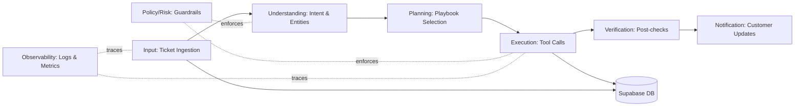
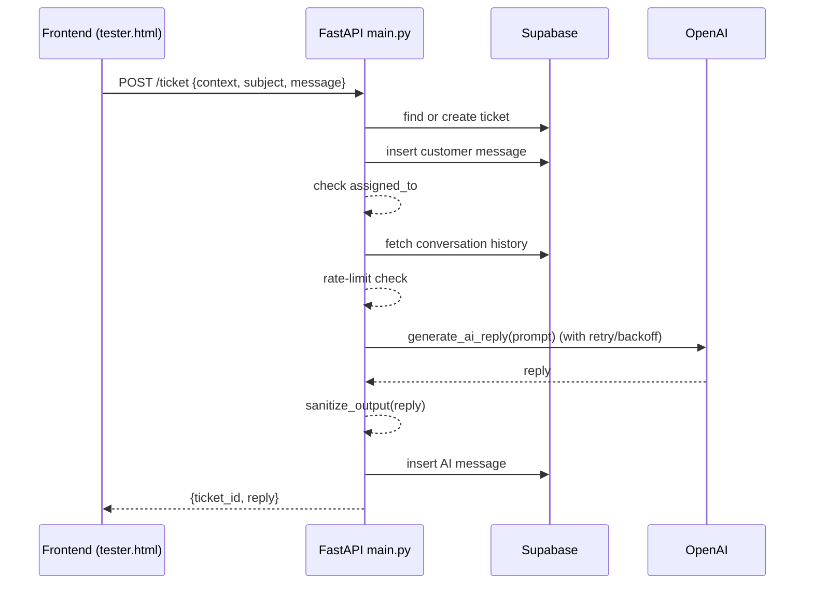

# Architecture & Flows

## High-level components

```mermaid
flowchart LR
  Ingest[Input: Ticket Ingestion]
  Understand[Understanding: Intent & Entities]
  Plan[Planning: Playbook Selection]
  Exec[Execution: Tool Calls]
  Verify[Verification: Post-checks]
  Notify[Notification: Customer Updates]
  Policy[Policy/Risk: Guardrails]
  Obs[Observability: Logs & Metrics]
  DB[(Supabase DB)]

  Ingest --> Understand --> Plan --> Exec --> Verify --> Notify
  Exec --> DB
  Ingest --> DB
  Policy -. enforces .- Understand
  Policy -. enforces .- Exec
  Obs -. traces .- Ingest
  Obs -. traces .- Exec
```

## Request flow (current implementation)

```mermaid
sequenceDiagram
  participant UI as Frontend (tester.html)
  participant API as FastAPI main.py
  participant DB as Supabase
  participant AI as OpenAI

  UI->>API: POST /ticket {context, subject, message}
  API->>DB: find or create ticket
  API->>DB: insert customer message
  API-->>API: check assigned_to
  API->>DB: fetch conversation history
  API-->>API: rate-limit check
  API->>AI: generate_ai_reply(prompt) (with retry/backoff)
  AI-->>API: reply
  API-->>API: sanitize_output(reply)
  API->>DB: insert AI message
  API-->>UI: {ticket_id, reply}
```
