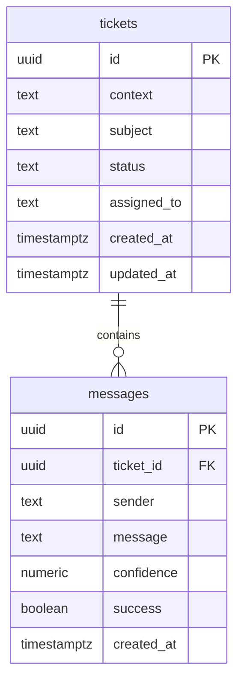

# Database

## ER Diagram


## Important indexes
- tickets(status)
- tickets(context, subject, status)
- messages(ticket_id)

## SQL reference (creation)
See README for the full SQL; key parts are:
```sql
create table if not exists public.tickets (
  id uuid primary key default gen_random_uuid(),
  context text not null,
  subject text not null,
  status text not null default 'open',
  assigned_to text,
  created_at timestamptz not null default now(),
  updated_at timestamptz not null default now()
);

create table if not exists public.messages (
  id uuid primary key default gen_random_uuid(),
  ticket_id uuid not null references public.tickets(id) on delete cascade,
  sender text not null,
  message text not null,
  confidence numeric,
  success boolean,
  created_at timestamptz not null default now()
);
```
